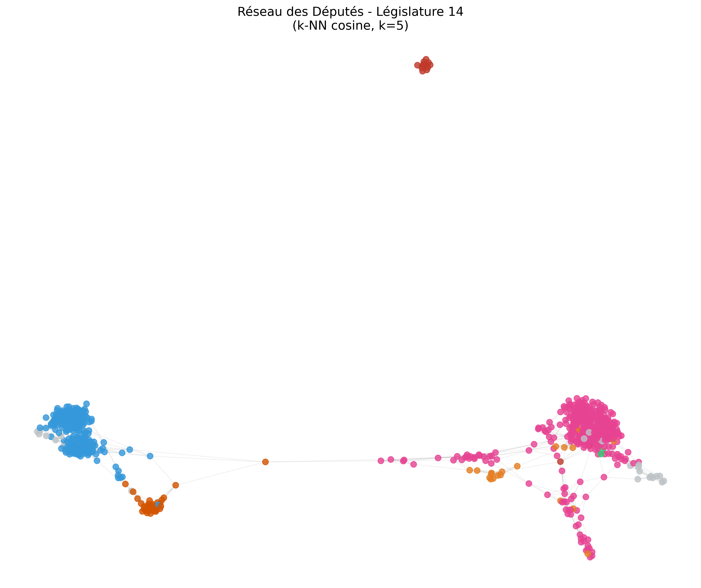
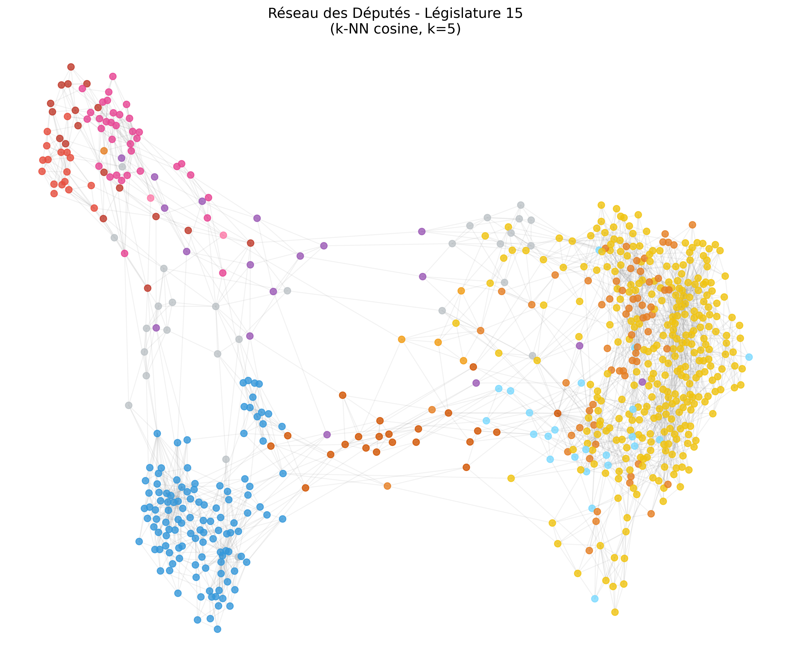
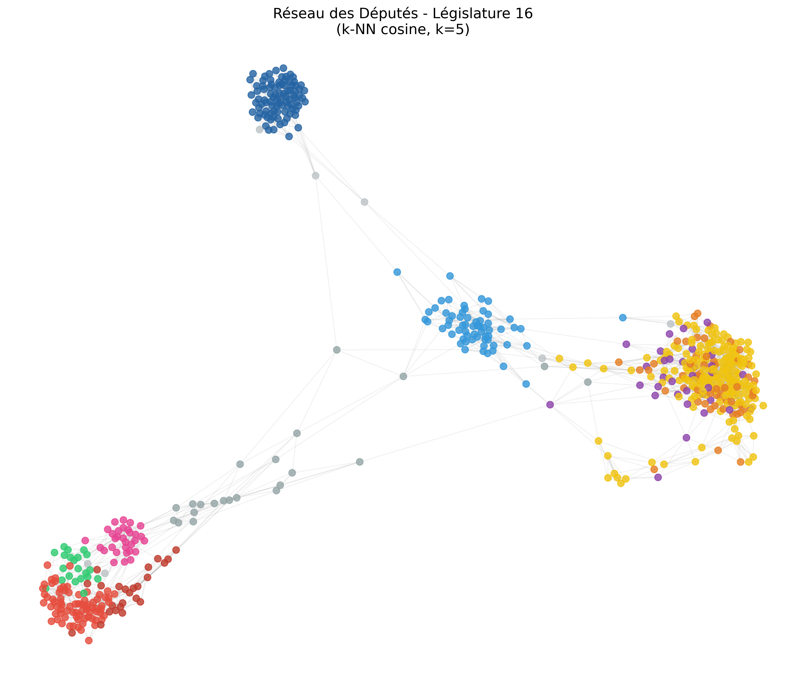

<style>
/* 2. LE TABLEAU (Général) */
  .article-content table {
    width: 100% !important;
    display: table !important;
    border-collapse: collapse;
    margin-bottom: 2em;
  }

  /* Par défaut, on laisse les colonnes s'ajuster (pour le tableau des couleurs) */
  .article-content td {
    vertical-align: top !important; 
    padding: 10px !important;
    border-bottom: 1px solid #eee;
  }

  /* 3. EXCEPTION POUR LES GRAPHES (Législatures) */
  /* Si le tableau a 3 colonnes, on force les largeurs égales pour vos graphes */
  .article-content table tr th:first-child:nth-last-child(3),
  .article-content table tr th:first-child:nth-last-child(3) ~ th,
  .article-content table tr td:first-child:nth-last-child(3),
  .article-content table tr td:first-child:nth-last-child(3) ~ td {
    width: 33.33% !important;
  }

  /* 4. GESTION INTELLIGENTE DES IMAGES */
  .article-content table img {
    height: auto !important;
    display: block;
  }

  /* Si l'image est un "badge" de couleur (Shields.io), on la garde petite */
  .article-content table img[src*="shields.io"] {
    width: 90px !important; /* Taille fixe pour vos carrés de couleur */
    display: inline-block;
  }

  /* Si c'est un graphique (pas un badge), il prend toute la place de sa colonne */
  .article-content table img:not([src*="shields.io"]) {
    width: 100% !important;
    max-width: none !important;
  }
</style>
---

This project uses Graph Theory to analyze voting patterns in the French National Assembly. By treating MPs as nodes and voting similarity as edges, we map how MPs vote relative to each other, within and across political groups.

*Updated in September 2026: participation is now measured over all the periods an MP sat, several statements are backed by figures, and interpretations the data does not support were removed.*

---

## 1. Introduction and political context

### 1.1 Institutional framework

The French National Assembly is the lower chamber of the French bicameral parliament. It is composed of **577 Members of Parliament** elected by a two-round single-member plurality voting system in geographically defined constituencies. Members of Parliament form **political groups** organized according to their electoral and ideological affinities.

For illustrative purposes, Figure 1 presents the composition of three consecutives legislatures by political group:

| 14th Legislature | 15th Legislature | 16th Legislature |
| :---: | :---: | :---: |
| <a href="L14_distribution.png" target="_blank"></a> | <a href="L15_distribution.png" target="_blank"></a> | <a href="L16_distribution.png" target="_blank"></a> |

**Figure 1:** Distribution of the 577 Members of Parliament by political group.

Each Member of Parliament (MP) in the National Assembly is affiliated with a specific political group. While these groups often correspond to a single political party, this is not always the case. A notable example is the Rassemblement National (RN) during the 15th legislature (2017–2022): although several MPs were members of this party, they did not form an official parliamentary group.

> We have more than 577 MPs because of resignations and replacements during the legislature.

### 1.2 Motivations and research questions

The objective of this project is to map the various political currents and their relative positioning by leveraging parliamentary voting data. Several questions naturally arise:

1. What is the true ideological landscape beyond group labels?
2. Does the historical left-right divide still exist?
3. How has this structure changed between two major legislatures?

Our approach:
- Treats each ballot vote as a **dimension in a political vector space**
- Uses **cosine similarity** as a similarity metric
- Applies **spatialization** techniques (force-directed layout) and **principal component analysis** to visualize these data.

### 1.3 Overview of main political forces

To facilitate the interpretation of the spatialization graphs, the table below summarizes the main political groups, their associated colors in our study, and their core principles according to their official platforms.


| Color | Party/Group | Brief Description (Official Stance) | Source |
| :--- | :--- | :--- | :--- |
|  | **LFI / LFI-NUPES** | Focuses on ecological planning, wealth redistribution, and a constitutional shift to a 6th Republic. | [lafranceinsoumise.fr](https://lafranceinsoumise.fr) |
|  | **ECOLO** | Advocates for environmental sustainability, social-ecology, and biodiversity protection. | [lesecologistes.fr](https://lesecologistes.fr) |
|  | **SRC / SER / SOC** | Social-democratic model, defense of public services, and labor rights (Historical Socialist groups). | [parti-socialiste.fr](https://parti-socialiste.fr) |
|  | **GDR** | Defense of the working class, social justice, and opposition to liberal economic policies. | [pcf.fr](https://pcf.fr) |
|  | **REN / LREM** | Supports economic competitiveness, full employment policies, and European integration. | [parti-renaissance.fr](https://parti-renaissance.fr) |
|  | **DEM / RRDP** | Centrist approach, institutional balance, and education (includes center-left Radicals). | [mouvementdemocrate.fr](https://www.mouvementdemocrate.fr) |
|  | **HOR** | Focuses on long-term national stability, security, and supporting the presidential majority. | [horizonsleparti.fr](https://horizonsleparti.fr) |
|  | **UMP / LR** | Advocates for fiscal discipline, restoration of state authority, and economic liberalism. | [republicains.fr](https://republicains.fr) |
|  | **RN** | Prioritizes national sovereignty, immigration control, and national priority policies. | [rassemblementnational.fr](https://rassemblementnational.fr) |
|  | **UDI / UAI** | Liberal-humanist and pro-European project centered on a social-market economy. | [parti-udi.fr](https://parti-udi.fr) |
|  | **LIOT** | An independent group focused on territorial interests, decentralization, and local governance. | [groupe-liot.fr](https://groupe-liot.fr) |
|  | **NI** | Non-affiliated members who do not belong to any parliamentary group. | [assemblee-nationale.fr](https://www.assemblee-nationale.fr) |


> **Note:** Descriptions are synthesized from the "Manifesto" or "Our Values" sections of the parties' official websites to ensure alignment with their self-defined political identity.
---


## 2. Framework and methodology

### 2.1 Vector representation of votes

#### 2.1.1 The space of parliamentary votes

Each Member of Parliament can be represented by a **vote vector** $\mathbf{v}_i \in \mathbb{R}^n$, where $n$ is the number of ballot votes analyzed. Formally:

$$
\mathbf{v}_i = (v_{i,1}, v_{i,2}, \ldots, v_{i,n})
$$


Each component $v_{i,j}$ encodes the MP's position on a specific vote $j$:
- $+1$ : In favor (Vote for the motion)
- $-1$ : Against (Vote against the motion)
- $0$ : Abstention (Present but did not take a position)
- $\text{NaN}$ : No recorded vote (absent, or present without voting)


#### 2.1.2 Vote matrix and data structure

After collecting votes via the NosDéputés.fr API, we construct a **vote matrix** $M \in \mathbb{R}^{m \times n}$:

- $m$ = number of MPs
- $n$ = number of ballot votes.

Each row corresponds to an MP's vote vector, and each column corresponds to a specific vote.

$$
M = \begin{pmatrix}
v_{1,1} & v_{1,2} & \cdots & v_{1,n} \\
v_{2,1} & v_{2,2} & \cdots & v_{2,n} \\
\vdots & \vdots & \ddots & \vdots \\
v_{m,1} & v_{m,2} & \cdots & v_{m,n}
\end{pmatrix}
$$

> **Note: what "ballot" means here, and what it does not.** The Assembly votes in three ways. Most decisions are taken **by show of hands** (*main levée*): the president of the sitting announces the result, and no individual position is recorded anywhere. A **public ballot** (*scrutin public*, ordinary or solemn) records each MP's position — for, against, abstention — and is held only when it is mandatory (motion of censure, organic laws) or requested by the government, a group chair, or the Conference of Presidents. A **secret ballot** is used for appointments. Only public ballots produce nominative data, and they are what the NosDéputés.fr API returns: our $n$ columns are public ballots, not all the votes held in the chamber.
>
> So $\text{NaN}$ means "no vote recorded in a public ballot", which is not the same as absence from the chamber. Two consequences are worth keeping in mind throughout. Proxy votes (*délégation de vote*) are recorded like any other, so a recorded vote is not proof of presence either. And the lowest participation figures often have institutional causes: the **President of the Assembly** presides over the sitting and by convention takes part in votes only exceptionally (Yaël Braun-Pivet, 0.15% of the ballots of the 16th Legislature), and an MP **appointed to the government** is replaced by their substitute one month later (Article 23 of the Constitution), so only the periods when they sat are counted — Carole Grandjean and Clément Beaune, ministers from July 2022 to January 2024, are the next two lowest. These MPs are at the bottom of the ranking for reasons that have nothing to do with how assiduous they are.

### 2.2 Handling missing data

**Major challenge:** The matrix $M$ contains missing values (NaN), corresponding to ballots where the MP's vote was not recorded.

Two analytical frameworks are considered:

- **“Presence-Only” (Pearson, Agreement Ratio):** Measures agreement on the ballots both MPs voted on. It does not depend on the total volume of activity, but rests on few ballots when participation is low.
- **“Volume-Aware” (Cosine, Jaccard):** Integrates the level of activity into the geometry. By treating absence as a null component ($0$), it stabilizes the positions of inactive MPs by preventing them from reaching extreme similarity scores based on a single shared vote.

### 2.3 Four similarity metrics

#### 2.3.1 Cosine similarity (chosen approach)

Cosine similarity measures the **directional alignment** between two vectors:

$$
S_{\cos}(\mathbf{A}, \mathbf{B}) = \frac{\mathbf{A} \cdot \mathbf{B}}{\|\mathbf{A}\| \cdot \|\mathbf{B}\|} = \frac{\sum_{j=1}^{n} A_j B_j}{\sqrt{\sum_{j=1}^{n} A_j^2} \sqrt{\sum_{j=1}^{n} B_j^2}}
$$

**Implementation:** NaN values are imputed as $0$.

**Justification:**
- **Numerator:** each ballot where both MPs voted the same way (for/for or against/against) adds $+1$, each ballot where they voted in opposite ways adds $-1$, and a ballot where either abstained or has no recorded vote adds $0$.
- **Denominator:** divides by the length of each vote vector, so the result depends on the direction of the vectors rather than on their length.

**Properties:**
- Range: $S_{\cos} \in [-1, +1]$.
- The result still depends on which ballots each MP voted on: two MPs who never voted on the same ballots have a similarity of $0$.

#### 2.3.2 Pearson correlation

$$
\rho(\mathbf{A}, \mathbf{B}) = \frac{\mathbb{E}[(\mathbf{A} - \bar{A})(\mathbf{B} - \bar{B})]}{\sigma_A \sigma_B}
$$

**NaN handling:** Pairwise deletion.

**Limitation:** with pairwise deletion, the correlation is computed on the ballots both MPs voted on. If two MPs coincide on only a few votes and agree, Pearson can yield a perfect correlation ($+1.0$) based on very few ballots.

#### 2.3.3 Jaccard similarity

$$
S_{\text{Jaccard}} = \frac{|\text{Agreements}|}{|P_A \cup P_B|}
$$

where $P_A$ and $P_B$ are the sets of votes where MPs A and B were present.

**Problem:** The **union** in the denominator lowers the similarity of two MPs with different activity levels, even if they agree on 100% of the ballots they both voted on.

#### 2.3.4 Weighted agreement

$$
S_{\text{agreement}} = \frac{|\text{Agreements}|}{|P_A \cap P_B|}
$$

**Problem:** many pairs of MPs from the same group agree on every ballot they both voted on ($S = 1.0$): in the 16th Legislature, 11% of Renaissance pairs, 16% of LFI pairs and 1% of RN pairs. The metric then separates members of the same group poorly.

### 2.4 Synthesis: choice of metric

For this study, **we use cosine similarity**. Unlike Pearson, it does not give high similarities based on very few shared ballots. Unlike the Agreement Ratio, differences in which ballots MPs voted on, and individual deviations, translate into different similarities.

---

## 3. Voting network

### 3.1 Graph construction via k-NN

Rather than creating a complete graph (potentially 150k+ edges), we use a **k-nearest neighbors topology**:

For each Member of Parliament $i$:
1. Compute $S_{\cos}(i, j)$ for all other MPs $j$
2. Retain the $k = 5$ neighbors with the highest similarity
3. Add a weighted edge $(i, j)$ with weight = $S_{\cos}(i, j)$

### 3.2 Layout algorithm: spring model

To spatialize the graph in 2D, we apply the **Fruchterman–Reingold** algorithm (force-directed layout). All MPs are thrown randomly onto the plot, and the algorithm iteratively adjusts their positions, driven by two competing forces. At each iteration every MP moves in the direction of the resulting force, by a distance (the "temperature") that decreases linearly, so the layout gradually freezes. The figures below use at most 400 iterations (the computation stops at iteration 392 or 393, when the moves become negligible) and a fixed random seed, and the final map is rotated to match the orientation of the PCA (section 4).

The first version of this article used `networkx.spring_layout` with 50 iterations. For graphs of 500 nodes or more, networkx 3.6 does not run these iterations: it minimizes an energy built from the same forces, plus a "gravity" term that pulls each connected component towards the centre, with at most 50 steps of an optimizer (L-BFGS). With that setting, two runs from different random starts gave noticeably different maps for the 14th and 16th Legislatures, and similar ones for the 15th. The figures were regenerated with the iterative algorithm described above, which networkx uses for smaller graphs.

$$
F_{\text{rep}}(i, j) = \frac{k^2}{d_{ij}}
$$
$$
F_{\text{attr}}(i, j) = \text{weight}_{ij} \cdot \left(-\frac{d_{ij}^2}{k}\right)
$$

These are the forces of Fruchterman and Reingold (1991); as in networkx, the attraction is multiplied by the weight of the edge, and applies only to linked MPs.

where:
- $\text{weight}_{ij}$ = The Cosine Similarity between MP $i$ and MP $j$. The more they vote alike, the stronger the pull.
- $F_{\text{rep}}$ = repulsion (every node pushes others away to avoid clutter).
- $F_{\text{attr}}$ = attraction
- $d_{ij}$ = Euclidean distance between MP $i$ and MP $j$ on the 2D map.
- $k$: the optimal distance between nodes ($k = 0.15$ here). It changes the spacing of the map, and therefore the layout.

For Linked MPs (The Top 5 Neighbors): the attraction grows with the similarity weight, so two linked MPs with a high similarity tend to end up close to each other.

For Non-Linked MPs (Everyone else): the distance $d_{ij}$ does not directly reflect their similarity. The algorithm doesn't see the similarity between two MPs who aren't in each other's Top 5. Their distance on the map results from the repulsion force ($F_{\text{rep}}$) and from the chains of links attaching each of them to their own cluster: two MPs whose clusters share no links end up far apart, without the algorithm having compared them directly.


**Reading the map:**
* **Clusters:** MPs whose nearest neighbours belong to their own group form dense, color-coded clouds.
* **Between clusters:** MPs whose nearest neighbours belong to several groups are positioned between these clouds.

| 14th Legislature (2012-2017) | 15th Legislature (2017-2022) | 16th Legislature (2022-2024) |
| :---: | :---: | :---: |
| <a href="L14_network_cosine.png" target="_blank"></a> | <a href="L15_network_cosine.png" target="_blank"></a> | <a href="L16_network_cosine.png" target="_blank"></a> |

**Figure 2:** Graph of the 14th, 15th, and 16th legislatures using cosine similarity. Nodes are colored by political group. In the 14th Legislature, 13 of the 15 GDR MPs are linked only to each other: they form a component disconnected from the rest of the graph (top of the figure), whose position relative to the other MPs is arbitrary.


#### Observations:

- Group sizes change a lot between legislatures. Counting the MPs with recorded votes (replacements included), the Socialist group goes from 333 MPs (SRC, then SER) in the 14th Legislature to 37 (SOC, NG) in the 15th and 31 (SOC-A, SOC) in the 16th; LR (UMP, then Les Républicains) from 208 to 119 and 62.
- In the 16th Legislature, the five nearest neighbours of the 34 Horizons MPs are mostly Horizons (73 links), Renaissance (69) and MoDem (25) MPs; one link goes to an LR MP.


## 4. Principal component analysis (PCA):

We saw in section 2.1 that each MP is represented by a vote vector in a high-dimensional space ($\mathbb{R}^n$ where $n$ is the number of ballot votes). To visualize this $n$-dimensional voting space, we apply Principal Component Analysis (PCA). This dimensionality reduction technique projects the voting vectors onto a 2D plane (PC1 and PC2), preserving the maximum variance. Two deputies appearing close on the plot tend to have similar voting records, within the limits of a 2D projection (see 4.2).


### 4.1 Foundations of PCA


Formally, let $\mathbf{M} \in \mathbb{R}^{m \times n}$ be the voting matrix (with $m$ MPs and $n$ votes). We first transform it into a standardized matrix $\mathbf{X}\_{\text{std}}$ where each element $x\_{i,j}$ is defined as:

$$x_{i,j} = \frac{m_{i,j} - \mu_j}{\sigma_j}$$

Where:
* **$m_{i,j}$**: The vote of MP $i$ for ballot $j$ (Abstention = 0).
* **$\mu_j$**: The **mean vote** for ballot $j$: $\mu_j = \frac{1}{m} \sum_{i=1}^{m} m_{i,j}$.
* **$\sigma_j$**: The **standard deviation** of ballot $j$: $\sigma_j = \sqrt{\frac{1}{m} \sum_{i=1}^{m} (m_{i,j} - \mu_j)^2}$.

**Standardization:** By centering each column and scaling it to unit variance, every ballot gets the same weight in the PCA. Without it, the ballots with the largest spread of values (high turnout, split votes) would weigh more than the others.


#### 1. Finding the principal axes
PCA identifies the two principal axes $\mathbf{u}_1, \mathbf{u}_2$ that maximize the **explained variance**. In other words, it looks for the directions along which the MPs are the most spread out:

$$
\mathbf{u}_k = \arg\max_{\|\mathbf{u}\|=1} \text{Var}(\mathbf{X}_{\text{std}} \mathbf{u})
$$

* **PC1:** The axis that captures the largest share of variance (12.2% in the 15th Legislature, 17.4% in the 16th). In both legislatures, the groups of the presidential majority (LREM and DEM in the 15th; REN, DEM and HOR in the 16th) are at one end, and LFI at the other end, with the other opposition groups on the same side as LFI (LR is close to the middle in the 16th).
* **PC2:** The axis perpendicular (orthogonal) to PC1 capturing the next largest share (2.3% and 7.4%). In the 15th Legislature it separates LFI and GDR from LR; in the 16th, the RN from LFI and the ecologists.

#### 2. Geometric projection
Each MP's standardized vector $\mathbf{x_i} \in \mathbb{R}^n$ is projected onto this plane to obtain their 2D coordinates $(z_{i,1}, z_{i,2})$:

$$
z_{i,1} = \mathbf{x_i} \cdot \mathbf{u_1}, \quad z_{i,2} = \mathbf{x}_i \cdot \mathbf{u}_2
$$

---

### 4.2 Interpretation of the PCA plots

1.  **Average behavior:** Because the data is centered via `StandardScaler`, the origin of the PCA plot represents the **mathematical average behavior** of the Assembly. 
2.  **Participation:** The plot shows several "branches" (mostly one per political group) starting from a common area. That area is where an MP with no recorded vote would land (after standardization, a row of zeros is not at the origin). The fewer ballots an MP votes on, the closer they are to it: the Spearman correlation between participation and the distance to that point on (PC1, PC2) is 0.79 in the 15th Legislature and 0.93 in the 16th.
3. **The 2D Projection Limit:** A cluster that appears compact in 2D may be more dispersed along the other principal components, so its visual dispersion is not a measure of the group's cohesion.

| 15th Legislature (2017-2022) | 16th Legislature (2022-2024) |
| :---: | :---: |
| <a href="L15_pca_Global.png" target="_blank"></a> | <a href="L16_pca_Global.png" target="_blank"></a> |

**Figure 5:** Principal Component Analysis for all ballot

The PCA of the 14th Legislature is not shown: our data contains 1,023 ballots for it, against 4,394 and 4,029 for the 15th and 16th.


### 4.3 Thematic analysis

We apply a **thematic classification** based on the title of each ballot vote. Themes include:
- Ecology & Territories (agriculture, climate, energy, transport)
- Economy & State (taxation, customs, inflation)
- Security & International Affairs (police, justice, defense)
- Solidarity & Social Policy (pensions, social benefits, disability)

This enables **theme-based analyses**.

#### Categorization Methodology

We implemented a **deterministic keyword-matching algorithm**. This process filters the legislative titles provided by the NosDéputés.fr XML API to categorize each vote into one of four themes.

> **Methodological Note:** > While a Large Language Model (LLM) would undoubtedly be more "sophisticated" at interpreting the nuanced context of legislative titles, we decided to stick to a keyword-based approach. It is simple and easily understandable.

The script scans each `titre` (title) tag within the XML response. The ballot is mapped to the first theme, in the order below, with a keyword appearing in the title:

```python
THEMATIQUES = {
    "Solidarité & Social": [
        "pauvreté", "handicap", "retraite", "social", "précarité", "apl", 
        "famille", "prestations", "rsa", "solidarité", "chômage"
    ],
    "Écologie & Territoires": [
        "écologie", "environnement", "climat", "nucléaire", "énergie", "biodiversité", 
        "eau", "agriculture", "agricole", "pesticide", "rural", "transport"
    ],
    "Économie & État": [
        "économie", "fiscal", "impôt", "inflation", 
        "douanes", "entreprises", "croissance"
    ],
    "Souveraineté & International": [
        "justice", "sécurité", "police", "prison", "immigration",
        "asile", "frontière", "armée", "défense", "europe"
    ]
}
```

#### Distribution of Ballots by Theme

The following table summarizes the volume of ballot votes analyzed for each legislature, categorized by the first matching theme. These themes serve as the basis for our comparative spatial analysis.

| Theme | 14th Legislature (2012-2017) | 15th Legislature (2017-2022) | 16th Legislature (2022-2024) |
| :--- | :---: | :---: | :---: |
| **Solidarity & Social** | 138 | 757 | 335 |
| **Ecology & Territories** | 73 | 641 | 709 |
| **Economy & State** | 72 | 157 | 68 |
| **Security & International** | 26 | 396 | 519 |
| **Total Analyzed Ballots** | **309** | **1,951** | **1,631** |

Our data contains 1,023 ballots for the 14th Legislature (2012–2017), 4,394 for the 15th (2017–2022) and 4,029 for the 16th (2022–2024, two years).

#### PCA by Theme

Beyond the global PCA, we repeat the analysis for each thematic domain. For example, for *“Solidarity & Social”*:

1. Filter $\mathbf{M}$ to retain only ballot votes labeled “solidarity” or "social"
2. Reapply PCA to this submatrix
3. Visualize: Points colored by political group
4. Compare the positions of the groups

The share of variance explained by PC1 differs between themes. It should be compared with care: it also depends on the number of ballots and differs between legislatures for all ballots taken together (see below).

| 15th Legislature (2017-2022) | 16th Legislature (2022-2024) |
| :---: | :---: |
| <a href="L15_pca_Solidarité_&_Social.png" target="_blank"></a> | <a href="L16_pca_Solidarité_&_Social.png" target="_blank"></a> |

**Figure 6:** Principal Component Analysis for ballot votes related to Solidarity and Social.

**Main observations:**

- 15th Legislature (757 ballots): PC1 explains 19.9% of the variance. LFI, GDR and SOC are at one end, LREM at the other; LR lies in between.

- 16th Legislature (335 ballots): PC1 explains 41.8% of the variance. LFI, the ecologists and SOC-A are at one end, REN, DEM and HOR at the other. LR and the RN lie in between, LR closer to the majority groups and the RN closer to the left groups. PC2 separates the RN and LR from the ecologists and LFI.

- The share of PC1 is higher in the 16th Legislature, but so is the share of PC1 for all ballots (17.4%, against 12.2%). For random sets of ballots of the same size, PC1 explains about 12% in the 15th Legislature and about 18% in the 16th.

---

In addition to PCA, we compute the **Betweenness Centrality** of each MP in the k-NN graph.

### 5 Pivots: betweenness centrality

Unlike degree, which counts an MP's links, this metric counts how often an MP lies on the shortest paths between other MPs.

#### 5.1. Definition
The centrality $g(v)$ of an MP $v$ is calculated by counting how many shortest paths between all other pairs of MPs pass through $v$:

$$g(v) = \sum_{s \neq v \neq t} \frac{\sigma_{st}(v)}{\sigma_{st}}$$

Where:
* $\sigma_{st}$ is the total number of shortest paths from MP $s$ to MP $t$.
* $\sigma_{st}(v)$ is the number of those paths that pass through $v$.

#### 5.2. Distance inversion and pathfinding
Since our graph edges represent **similarity** (Cosine Similarity), we must transform them into **distances** to find shortest paths. We define the distance $d_{ij}$ as:

$$d_{ij} = \frac{1}{\text{weight}_{ij} + \epsilon}$$

This inversion ensures that a high voting similarity results in a short distance. We call "pivots" the MPs with the highest betweenness: they lie on many of the shortest paths between other MPs, including between clusters.

#### 5.3. Results

Betweenness describes the position of an MP in the similarity graph; it is not a measure of political influence.

| Rank | 15th Leg. (2017-2022) | Group | | 16th Leg. (2022-2024) | Group |
| :--- | :--- | :---: | :---: | :--- | :---: |
| **1** | Jean-Luc Warsmann | UDI_I | | Nathalie Bassire | LIOT |
| **2** | Karine Lebon | GDR | | Emmanuelle Ménard | NI |
| **3** | Jennifer De Temmerman | LT | | Jean-Carles Grelier | REN |
| **4** | Thierry Michels | LREM | | Olivier Serva | LIOT |
| **5** | Agnès Thill | UDI_I | | Jean-Victor Castor | GDR |
| **6** | Lise Magnier | AGIR-E | | Mansour Kamardine | LR |
| **7** | Jean-Philippe Nilor | GDR | | David Habib | NI |
| **8** | Charles de Courson | LT | | Charles de Courson | LIOT |
| **9** | Brigitte Bourguignon | LREM | | Victor Catteau | RN |
| **10** | Paul Christophe | AGIR-E | | Laurent Panifous | LIOT |

In the 16th Legislature, four of the ten pivots are LIOT MPs and two are non-attached (NI). In the 15th, the ten pivots come from five groups, two from each (UDI_I, GDR, LT, LREM, AGIR-E).

Their participation varies a lot. In the 16th Legislature, Jean-Carles Grelier, Olivier Serva, Jean-Victor Castor, Mansour Kamardine and David Habib each voted on 10% of the ballots or fewer (over the periods they sat), while Emmanuelle Ménard (54%) and Victor Catteau (57%) are among the MPs who vote most often. In the 15th, Jean-Luc Warsmann voted on 3% and Jean-Philippe Nilor on 7%; the eight others on 15% to 32%. The ranking is therefore best read together with participation.

## 6. Conclusion:

### 6.1 Main observations

1. **PC1** separates the groups of the presidential majority from the opposition groups, in both the 15th and the 16th Legislatures. It explains 12.2% and 17.4% of the variance.
2. **PC2** separates LFI and GDR from LR in the 15th Legislature, and the RN from LFI and the ecologists in the 16th.
3. **Participation** shapes the plots: MPs who vote on few ballots are close to the point where an MP with no recorded vote would land.

### 6.2 Pivots

Pivots are the MPs with the highest betweenness in the similarity graph. Their participation ranges from 3% to 57% of the ballots, so this ranking should be read together with participation.

### 6.3 Limitations

PC1 and PC2 together explain 14.5% of the variance in the 15th Legislature and 24.8% in the 16th. The other components are not analyzed here.

### 6.4 Reproducibility

The full source code is available in the GitHub repository: [Networks-Analysis](https://github.com/Ines2r/Networks-Analysis)

---

## References & Data Sources

* **NosDéputés.fr API** [https://www.nosdeputes.fr/api/](https://www.nosdeputes.fr/api/)  
  *Provides access to parliamentary activities and metadata.*

* **Assemblée Nationale Open Data Portal** [https://data.assemblee-nationale.fr/](https://data.assemblee-nationale.fr/)  
  *Official repository for voting records, law proposals, and legislative history.*

---
## Appendices

### Appendix A: Intra-Group Analysis

For each political group $P$, we compute two distinct metrics:

1. **Cohesion Leader (Intra-Group)**:
   - Restrict the graph to members of $P$ only
   - Identify the node with the maximum weighted degree in this subgraph
   - This is the MP with the largest sum of similarity weights to the members of their own group they are linked to.

2. **Hub Leader (Global)**:
   - Identify the node from the group with the maximum weighted degree in the full graph
   - The weighted degree adds up the similarity weights of all the MP's links: to their own 5 nearest neighbours, and to the MPs who have them among theirs.


<div align="center">

| Group | Cohesion Leader (Intra) | Hub Leader (Global) |
| :--- | :--- | :--- |
| **LREM** | Marie-Christine Verdier-Jouclas | Marie-Christine Verdier-Jouclas |
| **LR** | Bernard Deflesselles | Bernard Deflesselles |
| **SOC** | Christine Pires Beaune | Christine Pires Beaune |
| **LFI** | Mathilde Panot | Mathilde Panot |

**Figure 3:** Key Leaders for the 15th Legislature
</div>

<br>

<div align="center">

| Group | Cohesion Leader (Intra) | Hub Leader (Global) |
| :--- | :--- | :--- |
| **REN** | Claire Guichard | Claire Guichard |
| **RN** | Victor Catteau | Victor Catteau |
| **LFI-NUPES** | Anne Stambach-Terrenoir | Anne Stambach-Terrenoir |
| **LR** | Jean-Jacques Gaultier | Michel Herbillon |

**Figure 4:** Key Leaders for the 16th Legislature
</div>

**Participation of the leaders**

- Claire Guichard (REN) and Victor Catteau (RN) voted on 66% and 57% of the ballots of the 16th Legislature, and Marie-Christine Verdier-Jouclas (LREM) on 44% of those of the 15th: among the highest values of their groups.
- The LR leaders voted on few ballots: Bernard Deflesselles on 4% in the 15th Legislature (LR median: 12%), Jean-Jacques Gaultier on 7% and Michel Herbillon on 5% in the 16th (LR median: 13%). The ballots they voted on have a high turnout (for Bernard Deflesselles, a median of 517 recorded voters, against 80 over all ballots), and they voted with the majority of their group 87% (Deflesselles) and 94% (Gaultier, Herbillon) of the time.
- Being a leader in the sense of weighted degree therefore does not require voting often.
- For comparison, Marine Le Pen voted on 9% of the ballots of the 15th Legislature and 13% of the 16th (RN median: 30%); Jean-Luc Mélenchon on 23% of those of the 15th (LFI median: 20%).

Weighted degree describes the position of an MP in the similarity graph; it is not a measure of political influence.

### Appendix B: Architecture and implementation of data retrieval

### 1 Data Source and API

**Primary source:** NosDéputés.fr, a freely accessible collaborative database, fed by the official data of the French National Assembly via its XML export protocols.

**API endpoints:**
```
https://www.nosdeputes.fr/{LEGISLATURE}/scrutins/xml
https://www.nosdeputes.fr/{LEGISLATURE}/scrutin/{SCRUTIN_ID}/xml
```

where `LEGISLATURE` $\in \{15, 16\}$ and `SCRUTIN_ID` is the numerical identifier of the vote.
Unfortunately, the API hasn't the same amount of data for previous legislatures. For the 14th legislature, we found an archive on [Asssemblée Nationale](https://data.assemblee-nationale.fr/).

### 2 Parallel download protocol

To accelerate data collection (approx 4,000 ballot votes), we use a **ThreadPoolExecutor** with up to 10 concurrent workers.

**Output:** Three CSV files generated
- `dataset_scrutins_14.csv` (2012–2017)
- `dataset_scrutins_15.csv` (2017–2022)
- `dataset_scrutins_16.csv` (2022–2024)

Each record: `{depute, group, position, scrutin_id}`

### 3 Transformation into a pivot matrix

The raw list of votes is transformed into a **sparse matrix**:

```python
pivot_votes = df.pivot_table(
  index='depute', 
  columns='scrutin_id', 
  values='vote_val'
)
```

---
